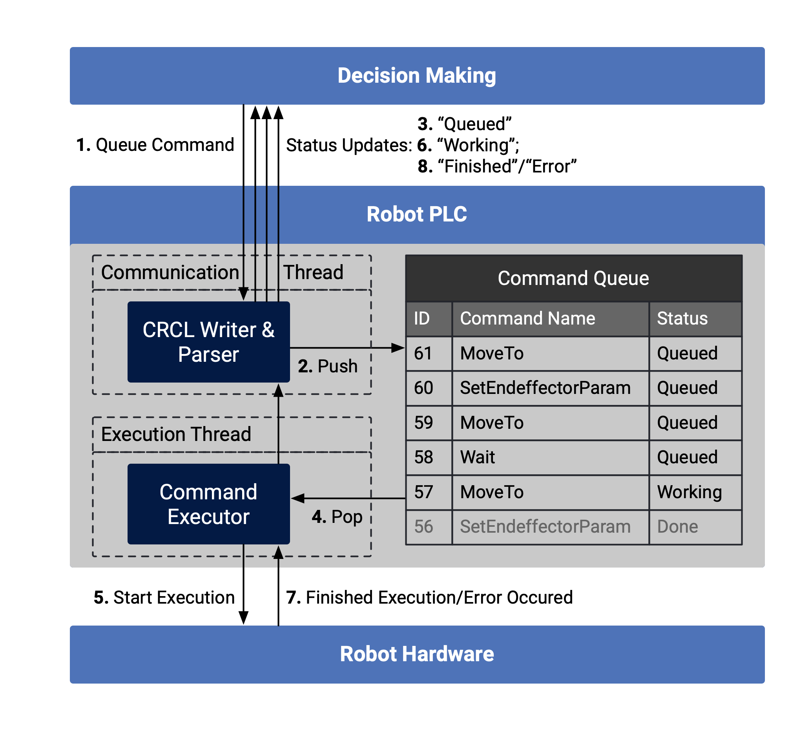

# CRCLJS

Specification and Javascript implementation of the queued streaming robot motion interface CRCL-JS, an adapted minimal JSON-based version of [CRCL](https://github.com/usnistgov/crcl/blob/master/doc/Reference.md). 

There are also two specific implementations:

- a Node-JS specific implementation: [CRCL-JS-Node](https://github.com/PRIARobotics/CRCLJS-Node)
- a browser version with websockets: [CRCL-JS-WS](https://github.com/prIArobotics/CRCLJS-ws), which needs a socket-websocket-gateway, the [CRCLJS-WSAdapter](https://github.com/PRIARobotics/CRCLJS-WSAdapter).

The main principle of CRCL-JS is an implemented parallel communication and execution framework on the robot PLC which parses the received CRCL-commands, enqueues them and simultaneously executes them in a FIFO-manner. Every execution triggers multiple status notifications back to the High-Level System, depicted as Decision Making Component in the following figure.



## Tests

To test the reference implementation run
```
npm test
```

## Author

* **Timon Höbert**

# CRCL-Reference

## CRCLCommands

A CRCL-Command has the following fields, which can be ordered as follows for simpler parsing:

1. `CRCLCommand` : string - type of command determines the crcl params
2. `CommandID` : integer - unique positive identifier, incremental
3. (`Name`) : string - description of the command for humans
4. `CRCLParam` : object - additional parameters

### MoveTo

Moves the robot to the specified position in the specified manner, either as point to point movement or straight and with a specified blending radius.

#### CRCLParam:

1. `Pose` : object - target TCP position `X`, (`Y`), (`Z`), (`A`), (`B`), (`C`). The angles A,B,C are Euler angles in degrees: Fixed angles X-Y-Z (equivalent to rotating Z-Y'-X'' euler angles, equivalent to Yaw, Pitch, Roll)
2. (`Straight`) : boolean - if true, TCP stays in line between origin and target position, otherwise arbitrary trajectory (default).
3. (`Blending`) : float - blending radius in [mm] to blend this movement with the next movement, no blending with 0 (default)

#### Examples

```json
{
    "CommandID" : 1,
    "Name" : "Move Articulated Robot",
    "CRCLCommand" : "MoveTo",
    "CRCLParam" : { 
        "Pose" : {
            "X": -60.0,
            "Y": 120.0,
            "Z": 90.0,
            "A": -80.0,
            "B": 100.0,
            "C": 130.0
        },
        "Straight" : true
    }
}
```

```json
{
    "CommandID" : 2,
    "Name" : "Move Cartesian Robot",
    "CRCLCommand" : "MoveTo",
    "CRCLParam" : { 
        "Pose" : {
            "X" : -60.0,
            "Y" : 120.0,
            "Z" : 90.0,
            "C" : 130.0
        },
        "Straight" : true,
    }
}
```

```json
{
    "CommandID" : 3,
    "Name" : "Move Conveyor Belt",
    "CRCLCommand" : "MoveTo",
    "CRCLParam" : { 
        "Pose" : {
            "X" : 0.0,
        },
        "Straight" : true,
    }
}
```

### SetEndEffector

Sets the value of the active end-effector, for example, a gripper.

#### CRCLParam

1. `Setting` : float - tool, for example gripper, state between 0.0 and 1.0

#### Examples

```json
{
    "CRCLCommand" : "SetEndEffector", 
    "Name" : "Grasp", 
    "CommandID" : 4, 
    "CRCLParam" : {
        "Setting" : 0.0
    }
}
```


### SetEndEffectorParameters

Changes the active end-effector

#### CRCLParam

1. `ToolID` : integer - id of the tool, for example gripper id

#### Examples

```json
{
    "CRCLCommand" : "SetEndEffectorParameters", 
    "Name" : "Use Tool 7", 
    "CommandID" : 5, 
    "CRCLParam" : {
        "ToolID" : 7
    }
}
```

### SetTransSpeed

Sets the speed value

#### CRCLParam

1. (`Relative`) : float - fraction of the maximum translational speed.

#### Examples

```json
{
    "CRCLCommand" : "SetTransSpeed", 
    "Name" : "Set Movement Speed to 50 percent", 
    "CommandID" : 6, 
    "CRCLParam" : {
        "Relative" : 0.3
    }
}
```

### SetTransAccel

Sets the acceleration value

#### CRCLParam

1. (`Relative`) : float - fraction of the maximum translational acceleration.

#### Examples

```json
{
    "CRCLCommand" : "SetTransAccel", 
    "Name" : "Set movement acceleration to 50 percent", 
    "CommandID" : 7, 
    "CRCLParam" : {
        "Relative" : 0.3
    }
}
```

### Wait

waits for a specified time

#### CRCLParam

1. (`Time`) : float - time im seconds to wait

#### Examples

```json
{
    "CRCLCommand" : "Wait", 
    "Name" : "Wait 0.5s", 
    "CommandID" : 7, 
    "CRCLParam" : {
        "Time" : 0.5
    }
}
```

### Clear

Clears the currently enqueued commands.

#### CRCLParam

None.

#### Examples

```json
{
    "CRCLCommand" : "Clear", 
    "Name" : "Clear Queue", 
    "CommandID" : 8, 
    "CRCLParam" : {
    }
}
```

## CRCLStatus

The status messages which are sent back to the command sender after each event.

### Param

1. `CommandID` : integer - the CommandID of the command which is referenced with this status message
2. `StatusID` : integer - the unique positive status identifier, incremental
3. `CommandState` : string - state description enum:
    1. `CRCL_Queued` - command sucessfully parsed und put into the queue
    2. `CRCL_Working` - command started
    3. `CRCL_Done` - command finished
    4. `CRCL_Error` - command failed
4. (`StateDescription`) : string - description of the state for humans

### Examples

```json
{
    "CommandStatus": {
        "CommandID": 1,
        "StatusID": 1,
        "CommandState": "CRCL_Working"
    }
}
```
